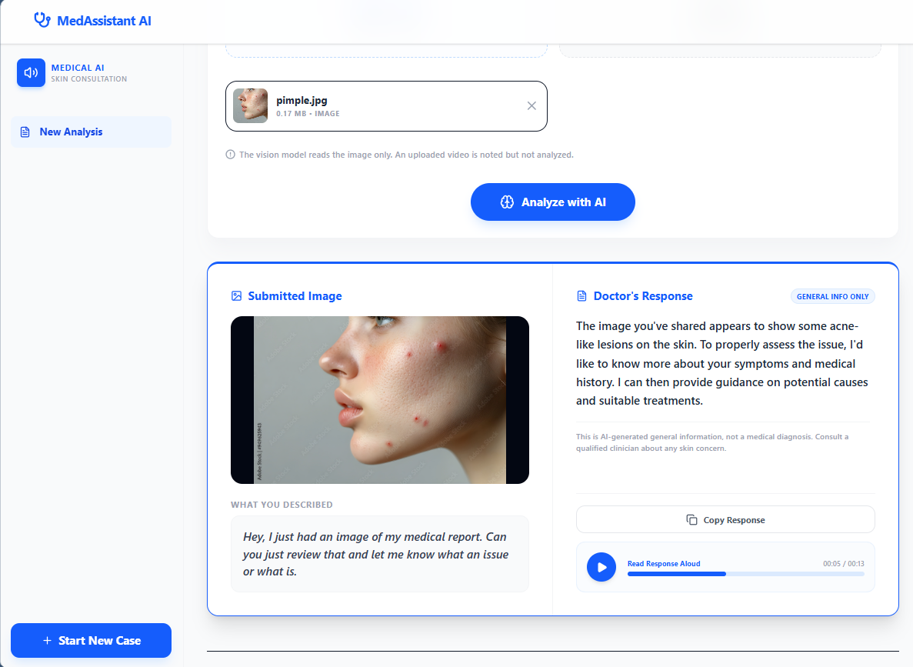

# health-agent - Skin Condition Consultation Workspace

MedAssistant AI is a production-grade, multimodal AI-powered diagnostic workspace for skin condition consultations. The system enables patients to upload a skin image (and optional video) and describe their symptoms using either clinical text or recorded voice notes. 

The application transcribes the patient's voice in real-time, processes the medical assets and description using a visual LLM, and responds with a synthesized clinical answer delivered in both clear text and spoken audio.

---

## 🖥️ Dashboard Preview



---

## 🚀 Key Features

* **Dual Symptom Descriptions**: Describe symptoms via a rich text editor or capture high-quality audio notes directly from the browser microphone.
* **Clinical Asset Uploads**: Supports uploading skin images (required for visual analysis) and optional patient videos.
* **Real-Time Audio Transcription**: Powered by Groq's Whisper API (`whisper-large-v3`) to translate patient speech notes into clinical text.
* **Intelligent Skin Analysis**: Powered by Groq's LLaMA Vision API (`meta-llama/llama-4-scout-17b-16e-instruct`) to review visual inputs and return structured, natural doctor responses.
* **Synthetic Voice Generation**: Powered by Deepgram's Speak API (`aura-2-thalia-en`) to read the doctor's response aloud.
* **Interactive Results Panel**: Provides copy controls, clear medical warnings, and a custom audio player with timeline scrubbing and elapsed tracking.
* **Sleek UI Design**: Modern dashboard built with **React (TypeScript + Vite)**, styled with **Tailwind CSS v4** and customized with **Lucide Icons**.

---

## 📂 Project Structure

```bash
health-agent/
├── frontend/               # React + TypeScript + Vite Application
│   ├── dist/               # Compiled production assets
│   ├── public/             # Public static assets (favicon, etc.)
│   ├── src/
│   │   ├── App.tsx         # Core Workspace React components
│   │   ├── index.css       # Tailwind CSS v4 & custom animations
│   │   └── main.tsx        # React entry point
│   ├── vite.config.ts      # Vite configuration & dev proxy
│   └── package.json        # Frontend Node dependencies
├── server.py               # FastAPI main backend server
├── brain_of_the_doctor.py  # Groq vision completions module
├── voice_of_doctor.py      # Deepgram TTS voice generation module
├── voice_of_patient.py     # Microphone capturing & Groq Whisper transcription
├── pyproject.toml          # Backend package specifications
├── uv.lock                 # Backend dependency lockfile
├── .env                    # Application API credentials & environment variables
└── README.md               # Project documentation
```

---

## ⚙️ Environment Variables (`.env`)

Create a `.env` file in the root directory of the project and populate it with the following configuration:

```env
# API Keys (Required)
GROQ_API_KEY=your_groq_api_key_here
DEEPGRAM_API_KEY=your_deepgram_api_key_here

# Model Configurations (Optional overrides)
GROQ_MODEL=meta-llama/llama-4-scout-17b-16e-instruct
WHISPER_MODEL=whisper-large-v3
DEEPGRAM_VOICE=aura-2-thalia-en
```

---

## 🛠️ Installation & Setup

### Prerequisites
* **Python**: `3.10+`
* **Node.js**: `18+` (npm `9+`)

### 1. Backend Setup
1. Create a virtual environment and activate it:
   ```bash
   python -m venv .venv
   # On Windows:
   .venv\Scripts\activate
   # On macOS/Linux:
   source .venv/bin/activate
   ```
2. Install the backend Python dependencies:
   ```bash
   pip install -r pyproject.toml
   # Or if you are using 'uv' (recommended):
   uv sync
   ```

### 2. Frontend Setup
1. Navigate to the `frontend/` directory:
   ```bash
   cd frontend
   ```
2. Install the frontend dependencies:
   ```bash
   npm install
   ```

---

## 🏃 Running the Application

### Option A: Development Mode (Hot-Reloading)
Run the backend and frontend in separate terminals for the best development experience:

1. **Start the FastAPI Backend** (from the root folder):
   ```bash
   .venv/Scripts/python -m uvicorn server:app --host 127.0.0.1 --port 7860
   ```
2. **Start the Vite Client** (from the `frontend` folder):
   ```bash
   npm run dev
   ```
3. Open your browser and navigate to the address output by Vite (typically `http://localhost:5173`).

### Option B: Production Mode (Served by FastAPI)
Build the React frontend into static assets and run them directly from FastAPI's server:

1. **Compile React Bundle** (from the `frontend` folder):
   ```bash
   npm run build
   ```
2. **Launch the FastAPI Server** (from the root folder):
   ```bash
   .venv/Scripts/python -m uvicorn server:app --host 127.0.0.1 --port 7860
   ```
3. Open your browser and navigate to `http://127.0.0.1:7860`.

---

## ⚠️ Disclaimer

MedAssistant AI provides AI-generated general information regarding skin appearance. It is **not** a medical device, does not provide official medical diagnoses, does not prescribe treatments, and must not replace consulting a licensed medical professional about any skin concern.